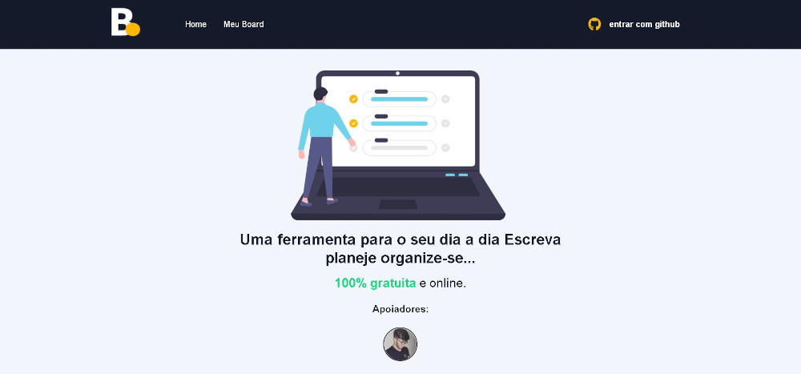

# Meu Board

<!---Esses são exemplos. Veja https://shields.io para outras pessoas ou para personalizar este conjunto de escudos. Você pode querer incluir dependências, status do projeto e informações de licença aqui--->
  

  
  

 
    > Uma ferramenta para o seu dia a dia Escreva planeje organize-se...

 

## 📚 Seções

O site é composto por quatro seções:

- **Home:** Aqui temos a apresentaçao do projeto;
- **Board:** Nesta seção se encontra a lista completa de suas tarefas;
- **Detalhes:**apresenta os detalhes da tarefa escolheida;
- **Donate:** seção de doação;
- **Obs**: Opção de edição e detalhes da tarefa inclusa somente a usuarios vips( doaram ao projeto );

---
 

## 🚀  Tecnologias e funcionalidades

O projeto possui funções de adição, edição e remoção de tarefa, login feito com github :

- Next.js;
- NextAuth.js( biblioteca para autenticação de usuario );
- TypeScript ;
- Styled-Components;
- FireBase ( Armazenameto de dados );
- Data-fns ( biblioteca para formatação de datas);

---

### Ajustes e melhorias

O projeto foi concluído e todas as tarefas finalizadas:

- [x] Tarefa 1
- [x] Tarefa 2
- [x] Tarefa 3
- [x] Tarefa 4
- [x] Tarefa 5

* Compatível `< Windows, Linux >`."

 
